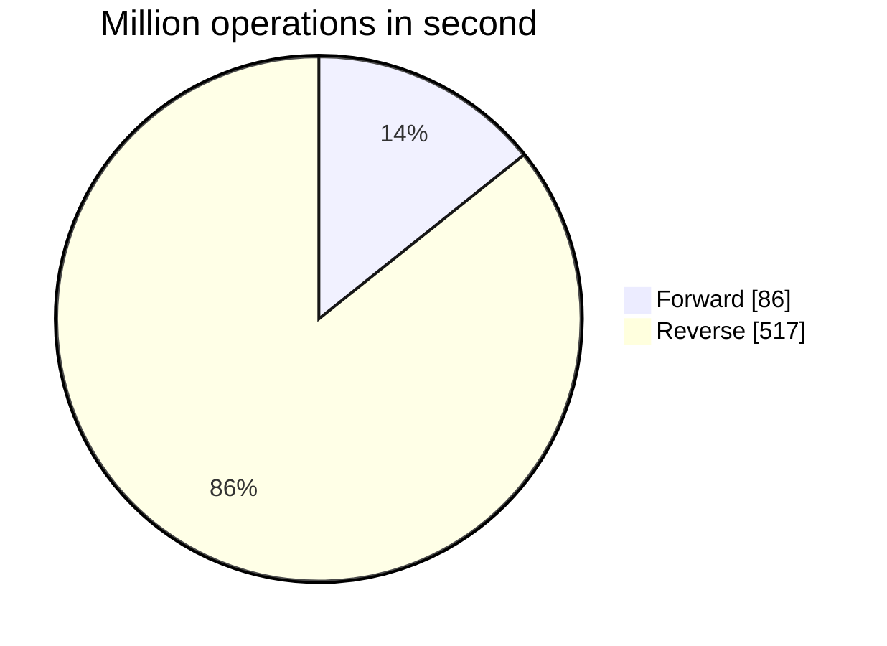

# Forward or Backward? 

This project aims to show how expensive extra function calls can be when defining a loop boundary.

## Description

In this example, we use the number of names in the path as the loop boundary. 
We can either start at the beginning of the path and work forward or at the end and work backward. 
The results show that working backward in a particular case is six times faster than working forward.
The reason for this is that in the first case, we call the method `Path::getNameCount` on every iteration of the loop, whereas in the last case, we call this function once at the beginning of the circle.

This example shows how important it is to calculate loop boundaries in advance.

## Methods to be benchmarked

```java
public class MyBenchmark {
    private static final Path SAMPLE_PATH = Path.of("/home/user/projects/dict/src/main/resources/words.txt");

    @Benchmark
    public int forwardLoop() {
        var count = 0;
        // calculate loop boundaries at each iteration
        for (
                var i = 0;
                i < SAMPLE_PATH.getNameCount();
                i++
        ) {
            count++;
        }
        return count;
    }

    @Benchmark
    public int reverseLoop() {
        var count = 0;
        // calculate loop boundaries once at the very beginning
        for (
                var i = SAMPLE_PATH.getNameCount();
                i > 0;
                i--
        ) {
            count++;
        }
        return count;
    }
}
```


## Running the benchmark

To execute the benchmark, access your project folder through the command line and execute the `mvn clean verify` command.
This action will generate the `target` folder within your project, housing the benchmarks Uber-JAR file that you'll utilize.
Next, proceed by running the `java -jar target/benchmarks.jar` command from the same location.
Once all benchmarks conclude, you'll receive the following completion message.

```text
Benchmark                 Mode  Cnt          Score         Error  Units
MyBenchmark.forwardLoop  thrpt   25   86563253.402 ±  198686.009  ops/s
MyBenchmark.reverseLoop  thrpt   25  517055621.588 ± 2150399.471  ops/s
```

I added a simple graph using the mermaid.js to represent digital data better.


